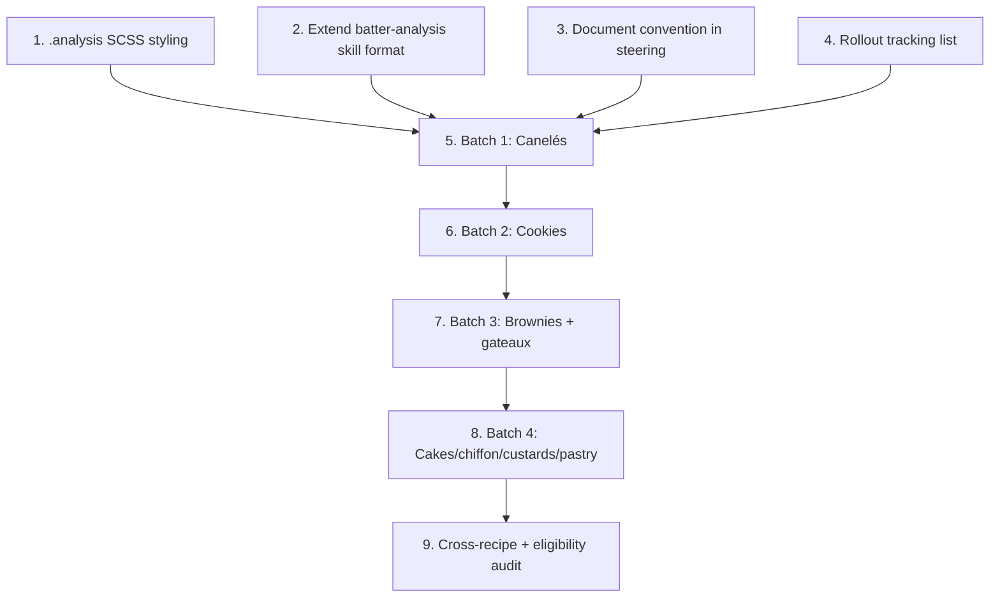

# Implementation Plan

## Overview

This plan rolls out an Analysis section across baking recipes. It first builds the foundation (styling, skill format, steering convention, tracking list), then authors Analysis sections in sequenced batches (canelés → cookies → brownies/gateaux → cakes/chiffon/custards/pastry), and finishes with a cross-recipe consistency and eligibility audit. The numbers are authored content computed via the batter-analysis skill; the only code change is CSS.

Two settled rules apply throughout:
- Coatings, glazes, frostings, and dustings are excluded from `total_batter_weight` (noted separately, never folded into the batter denominator).
- Borderline desserts (purin, tarte tatin, French silk pie) ARE analyzed, labeling which component (custard base / filling) is analyzed.

## Tasks

### Foundation

- [x] 1. Add `.analysis` block styling to `assets/main.scss`
  - Add a styled block parallel to `.notes`, using existing theme tokens (section color, Midnight text, `$grey-rule`).
  - Make it visually distinct from both Steps and Notes (thin accent rule or subtle tint in the section color), de-emphasized vs Steps.
  - Add dark-mode rules derived from Midnight variants (`$dark-muted`, `$dark-rule`) in the existing dark mixin.
  - Ensure the component table stays readable on narrow viewports and survives print (`print-color-adjust: exact` if a color accent is used).
  - Verify with `bundle exec jekyll build`.
  - _Requirements: 4.4, 4.5, 1.7_

- [x] 2. Extend the `batter-analysis` skill with the on-page Analysis block format
  - Add a subsection documenting the exact Markdown structure of the on-page block: `## Analysis` heading, total batter weight line, component table (Component | Amount | %), optional benchmark compare, 1–3 sentence takeaway.
  - State the one-decimal display rule and the higher-internal-precision allowance.
  - State the denominator rule: incorporated batter/dough ingredients only; exclude beeswax, coatings, glazes, frostings, dustings; note significant finishing components separately.
  - Note that composite desserts are analyzed by their primary batter/custard/filling component, labeled as such.
  - _Requirements: 2.5, 2.6, 3.1, 3.2, 4.2_

- [x] 3. Document the Analysis convention in `steering.md`
  - Add an "Analysis (baking recipes)" subsection: qualifying-recipe rule, fixed placement (between Steps and Notes), required internal structure, grams + one-decimal rules, coatings-excluded rule, pointer to the batter-analysis skill as source of truth.
  - Extend the New Recipe Checklist with a step: for baking recipes, add an `## Analysis` section computed via the skill.
  - _Requirements: 3.4, 4.1, 4.3, 5.4_

- [x] 4. Create the rollout tracking list
  - Add a checklist (in this tasks file, kept current) of every qualifying recipe with a done/remaining marker, grouped by the rollout sequence, including the borderline items (purin, tarte tatin, French silk pie).
  - _Requirements: 5.1, 5.5_

### Rollout — Batch 1: Canelés (validate format here first)

- [x] 5. Author Analysis sections for the canelé family
- [x] 5.1 Add Analysis to `canele` and `custardy-canele`
  - Decompose ingredients via the skill, compute components and percentages against total batter weight (exclude beeswax).
  - Include a benchmark comparison (custardy vs cakey) and takeaway; cross-link the Canelé Ratio Analysis article.
  - Verify mass conservation (±2g) and percentage closure (~100%).
  - _Requirements: 1.2, 1.3, 1.4, 1.5, 6.1, 6.2_
- [x] 5.2 Add Analysis to `chocolate-canele` and `chocolate-canele-ferrandi`
  - Decompose chocolate into cocoa butter / cocoa solids / sugar per the skill table.
  - Acknowledge any out-of-benchmark component in the takeaway.
  - _Requirements: 1.2, 1.5, 2.1, 6.3_
- [x] 5.3 Add Analysis to `white-chocolate-matcha-canele`, `white-chocolate-matcha-canele-ferrandi`, `eggnog-canele`
  - Treat matcha as inert solid (not structure); note it separately in the takeaway.
  - _Requirements: 1.2, 2.2, 6.3_
- [x] 5.4 Build, visually verify canelé batch in light/dark/print, commit
  - _Requirements: 4.5, 6.4_

### Rollout — Batch 2: Cookies

- [x] 6. Author Analysis sections for cookies/shortbread
  - `matcha-shortbread`, `double-chocolate-chip-cookies`, `matcha-white-choco-cookies`, `brown-butter-hojicha-cookies`, `matcha-latte-cookies`, `vietnamese-coffee-marble-cookies`.
  - Use the cookie benchmark (chewy vs crispy). Exclude sugar coatings and glazes from the dough denominator; note them separately.
  - For frosted cookies (matcha latte), analyze the cookie dough; give the ermine frosting its own labeled mini-breakdown if useful, never folded into the dough denominator.
  - Verify arithmetic per recipe; build and commit.
  - _Requirements: 1.2, 1.5, 2.2, 6.1, 6.2, 6.3, 6.4_

### Rollout — Batch 3: Brownies + gateau au chocolat

- [x] 7. Author Analysis sections for brownies and gateaux
  - `chocolate-brownies`, `matcha-brownies`, `chocolate-gateau-au-chocolat`, `matcha-gateau-au-chocolat`, `orange-chocolate-gateau-au-chocolat`, `hojicha-gateau-au-chocolat`, `vanilla-bean-gateau-au-chocolat`.
  - Use the brownie (fudgy vs cakey) benchmark for brownies; treat gateaux as low-flour chocolate cakes.
  - Verify arithmetic; build and commit.
  - _Requirements: 1.2, 1.5, 2.1, 6.1, 6.2, 6.4_

### Rollout — Batch 4: Cakes / chiffon / custards / pastry

- [x] 8. Author Analysis sections for remaining qualifying recipes
  - `earl-grey-chiffon-cake`, `matcha-chiffon-cake` (chiffon benchmark), `cherry-clafoutis` (thin custard batter), `crispy-butter-mochi` (add glutinous rice flour decomposition to the skill if missing).
  - Borderline items: `purin` (label "Custard base"), `tarte-tatin` (label the analyzed component), `french-silk-pie` (label "Filling").
  - Add any missing ingredient decompositions to the skill before use.
  - Verify arithmetic; build and commit.
  - _Requirements: 1.2, 2.6, 6.1, 6.2, 6.4_

### Verification

- [x] 9. Cross-recipe consistency and eligibility audit
  - Spot-check a shared ingredient (e.g. whole egg) decomposes identically across recipes.
  - Confirm no non-baking recipe gained an Analysis section and all qualifying recipes (incl. borderline) are done or tracked as remaining.
  - Confirm no coating/glaze/frosting was counted in any batter denominator.
  - Diff a couple of canelé analyses against the Canelé Ratio Analysis article for drift.
  - Final `bundle exec jekyll build`; update changelog.
  - _Requirements: 2.3, 1.6, 5.5, 3.3, 6.4_

## Task Dependency Graph



Foundation tasks 1–4 are independent of each other and can run in parallel, but all four gate Batch 1 (task 5). Batches run in sequence (5 → 6 → 7 → 8) so the format validated on canelés propagates forward. The audit (task 9) runs last.

```json
{
  "waves": [
    { "wave": 1, "tasks": ["1", "2", "3", "4"] },
    { "wave": 2, "tasks": ["5"] },
    { "wave": 3, "tasks": ["6"] },
    { "wave": 4, "tasks": ["7"] },
    { "wave": 5, "tasks": ["8"] },
    { "wave": 6, "tasks": ["9"] }
  ]
}
```

## Notes

- Numbers are authored, not computed at build time. Each Analysis block must be self-verified for mass conservation (±2g) and percentage closure (~100%) before commit.
- The batter-analysis skill is the single source of truth for decomposition values and benchmarks. Add any missing ingredient decomposition to the skill before using it in a recipe.
- Treat inert solids (matcha, hojicha) separately from structure solids; note them in the takeaway rather than folding into structure.
- Coatings, glazes, frostings, and dustings never count toward the batter denominator; note them separately.
- Borderline desserts (purin, tarte tatin, French silk pie) are analyzed by their primary batter/custard/filling component, labeled as such.
- Commit per batch with a build check; update the changelog in the final audit task.
